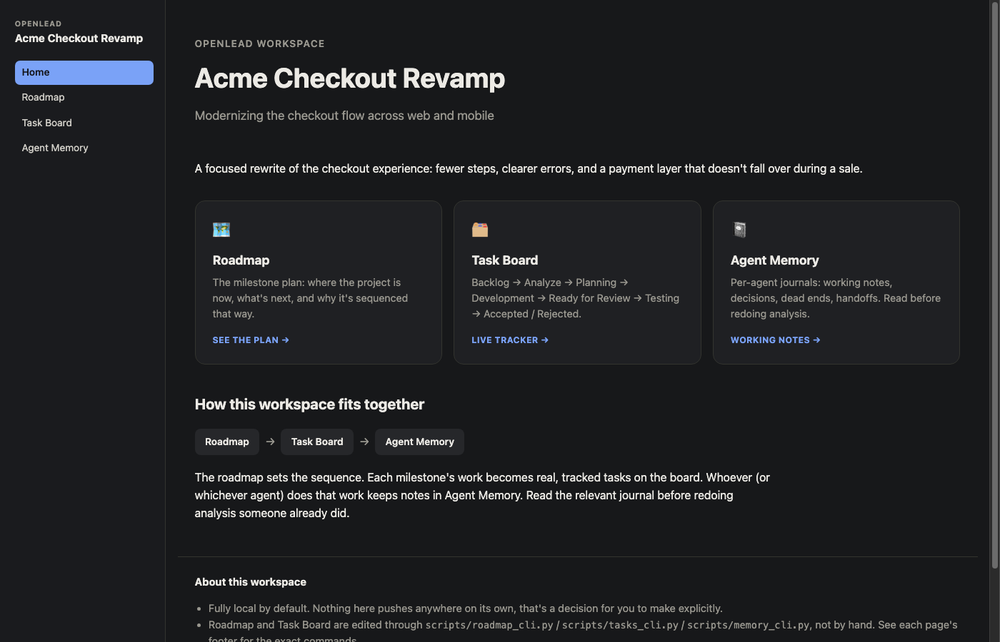
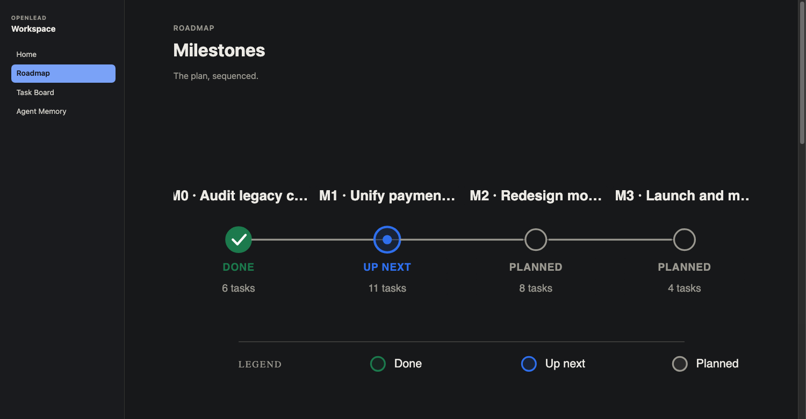
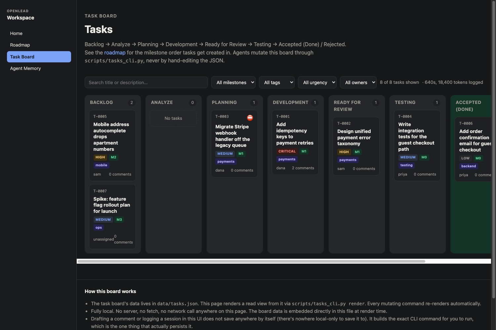
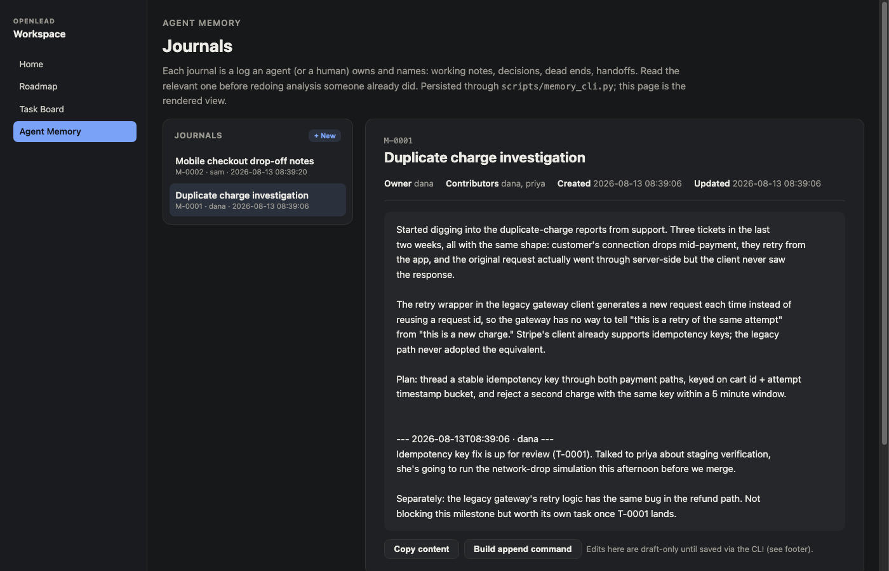

<div align="center">

```
              ██████╗  ██████╗  ███████╗ ███╗   ██╗   ██╗      ███████╗  █████╗  ██████╗
              ██╔═══██╗ ██╔══██╗ ██╔════╝ ████╗  ██║   ██║      ██╔════╝ ██╔══██╗ ██╔══██╗
              ██║   ██║ ██████╔╝ █████╗   ██╔██╗ ██║   ██║      █████╗   ███████║ ██║  ██║
              ██║   ██║ ██╔═══╝  ██╔══╝   ██║╚██╗██║   ██║      ██╔══╝   ██╔══██║ ██║  ██║
              ╚██████╔╝ ██║      ███████╗ ██║ ╚████║   ███████╗ ███████╗ ██║  ██║ ██████╔╝
              ╚═════╝  ╚═╝      ╚══════╝ ╚═╝  ╚═══╝   ╚══════╝ ╚══════╝ ╚═╝  ╚═╝ ╚═════╝
```

**A fully local roadmap, Kanban board, and agent memory for AI coding agents.**

[](LICENSE)
[](#quick-start)
[](SKILL.md)

</div>

---

A homepage, a milestone roadmap with an auto-generated diagram, a Kanban task board, and
per-agent memory journals. Four static HTML pages, each rendered from a JSON file, edited
only through a small Python CLI. No server, no build step, no framework, no account, no
network call anywhere. Nothing pushes to a remote on its own. That stays your decision.

Built for a setup where you're the team lead and your team is a set of coding agents. You set
direction, the agents work the board, and everything (status, blockers, who did what, how
long it took, how many tokens it burned) is visible in one place instead of scattered across
chat transcripts.

## Screenshots

Sample data below, a fictional "Acme Checkout Revamp" project, to show what a workspace looks
like once a team has actually used it for a while.

**Homepage.** Project name, tagline, and a card into each of the other three pages.



**Roadmap.** Milestones on a status track (done, up next, planned), auto-laid-out from
whatever milestones exist, with a detail card underneath each one.



**Task board.** A Kanban view with urgency, owner, and milestone filters, cards sorted by
urgency within each column, and a running total of agent time and tokens spent.



**Agent memory.** Per-agent journals: this one shows a working investigation, appended to
over time, with the full history kept rather than overwritten.



## Why

Agents are good at doing the next task. They're bad at remembering the last ten, at knowing
which one blocks which, and at leaving a trail a human, or a different agent next week, can
follow. OpenLead gives you and your agents a durable, boring, local place for that: a roadmap
that says what's next and why, a Kanban board with a real audit trail, and a journal system so
an agent's working notes outlive its context window.

## What you get

- **`index.html`**: the homepage, with the project name, tagline, and links to the other
  three pages.
- **`roadmap.html`**: milestones with a diagram (auto-laid-out from however many you have,
  colored by status: done, up next, or planned) and a detail card per milestone underneath.
- **`tasks.html`**: a Kanban board (Backlog → Analyze → Planning → Development → Ready for
  Review → Testing → Accepted / Rejected). Every task carries urgency, an optional milestone
  and tag, blockers, related tasks, a comment thread, a full timestamped activity log, and an
  agent work-session ledger (who worked on it, how long, how many tokens).
- **`memory.html`**: a left-hand list of journals, each one an agent's or human's running
  notes on a specific thread of work.
- **`scripts/project_cli.py` / `roadmap_cli.py` / `tasks_cli.py` / `memory_cli.py`**: the
  only way any of the above gets edited. Every mutating command re-renders its page
  automatically.

Every page works by opening the `.html` file directly in a browser: double-click it. There's
nothing to install to *view* it; you only need Python (3.8+, stdlib only, no dependencies) to
*edit* it.

## Quick start

```bash
git clone <this-repo> openlead
python3 openlead/scripts/init_workspace.py ~/projects/my-project/pm \
  --name "My Project" \
  --tagline "One-line description shown on the homepage"

cd ~/projects/my-project/pm
python3 scripts/roadmap_cli.py add --name "Get started" --status next
python3 scripts/tasks_cli.py add --title "First real task" --milestone M0
open index.html   # or just double-click it
```

That's it. No server to start, nothing to deploy. Re-running `init_workspace.py --force`
later re-copies the HTML/scripts (for an upgrade) without touching your existing
`data/*.json`.

## Using it with an AI coding agent

This repo ships as a **[Claude Code Agent Skill](https://docs.claude.com/en/docs/claude-code/skills)**. Drop it into
`.claude/skills/openlead/` (project-local) or `~/.claude/skills/openlead/` (global), and a
Claude Code agent picks it up automatically when the conversation is about setting up or
working inside a project roadmap/task-board/memory system.

**OpenCode reads the exact same file.** OpenCode's Skills system searches
`.claude/skills/<name>/SKILL.md` directly, alongside its own `.opencode/skills/` path, with the
same frontmatter spec (`name` + `description`), so this repo's `SKILL.md` works for both tools
unmodified. No adapter, no fork. See [OpenCode's own skills docs](https://opencode.ai/docs/skills/)
for the search paths and frontmatter spec this claim is based on.

**Any other agent with file and shell access can use it too.** The actual functionality is
four Python CLIs and four HTML files; the `SKILL.md` file is a discovery convenience for
tools that support that convention. For an agent tool without a skills mechanism, or one this
project hasn't verified (Cursor, Windsurf, Cline, and others each have their own rules/custom-
instructions convention that changes over time, so check that tool's current docs), point the
agent at this README and `SKILL.md` directly, or paste the relevant commands into whatever
instruction surface that tool provides.

### For agents: the short version

If you're an agent reading this because you were pointed here, read `SKILL.md`. It has the
exact command shapes for all four CLIs, the auto-logging behavior, and the convention for
recording how long you (or a subagent) spent on a task and how many tokens it used. The one
rule that matters most: **never hand-edit `data/*.json`**. Always go through the CLI, so ids,
timestamps, and the rendered HTML stay consistent.

## Architecture, in one paragraph

Every page embeds its own data as one `<script id="...-data" type="application/json">` block
and renders itself from that block with vanilla JS on load. No fetch, so it works from a bare
`file://` URL with zero CORS issues. Every CLI follows the same shape: read the JSON file,
mutate it, write it back, then regenerate ONLY that one embedded `<script>` block inside the
HTML (via a targeted regex substitution), never touching the page's CSS, layout, or JS. That's
what lets you customize a page's look without a future `render()` call clobbering it.

## What this is not

- Not a hosted product. There's no backend, no accounts, no sync between machines unless you
  build that yourself (e.g. by putting the workspace directory in your own git repo).
- Not a replacement for Jira/Linear/GitHub Issues on a real team with humans who need
  notifications, permissions, and integrations. It's a lightweight, local, agent-first
  substitute for the much narrower case of "an agent (or several) needs a durable place to
  track its own work on a project you're driving."

## Roadmap

Short version: a docs/wiki layer for agents to write up findings in a structured, linkable
form (not just flat journals); multi-project support; a single overview across all your
projects; and a skills manager (show/add/edit/delete/favorite the skills installed across
your agent setup). Full detail and rationale in [`ROADMAP.md`](ROADMAP.md).

## License

MIT. See [`LICENSE`](LICENSE).
